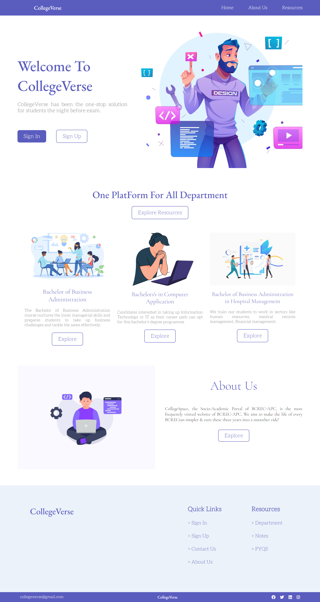

# 👀 College Verse 👀

CollegeVerse has been the one-stop solution for students the night before exam.


## 🚀 Features

- Responsive Design
- Previous Year Questions and Notes
- Sign In Feature


## 🧑‍🚀 Tech Stack

**Client:** Ejs, Css3

**Server:** Node, Express, MongoDB


## 🚀 Run Locally

Clone the project

```bash
  git clone https://github.com/ArnabMukherjee03/CollegeVerse
```

Go to the project directory

```bash
  cd CollegeVerse
```

Install dependencies

```bash
  npm install
```

Start the server

```bash
  npm start
```
Server
```bash
  localhost:3000
```
## 👀 Environment Variables

To run this project, you will need to add the following environment variables to your .env file

`MONGO_URL`

`SECRET`

## Screenshots



